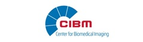

.. include:: ./links.inc

**pyGEDAI**
===========

GEDAI in python

.. image:: _static/img/logo.png

Generalized Eigenvalue De-Artifact Instrument (GEDAI) is a method to remove artifacts from EEG/MEG data based on generalized eigenvalue decomposition.

Citation
--------

If you use GEDAI in your research, please cite the original publication :footcite:t:`Ros2025`.

.. footbibliography::

License
-------

This software is licensed under the **PolyForm Noncommercial License 1.0.0**. For more details, see the :ref:`license` page.

Acknowledgements
----------------

We are gratefully supported by the Center for Biomedical Imaging (CIBM), the Swiss National Science Foundation (SNSF), and Unitec.

.. image:: _static/img/logo_snf.jpg

.. image:: _static/img/logo_fcbgmeeg.png
   :width: 140px

.. toctree::
   :hidden:
   :maxdepth: 0

   self
   api/index
   generated/tutorials/index
   license/index
   dev/index

